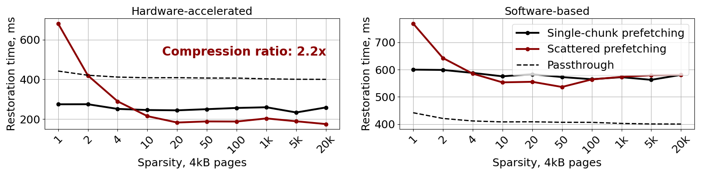

# Sabre plugin for Firecracker

Implementation of Sabre plugin for Firecracker described in the paper ["Sabre: Improving Memory Prefetching in Serverless MicroVMs with Near-Memory Hardware-Accelerated Compression"]().

The full diff: `git diff 5326773`.

## Dependencies
* docker
* glibc-2.35 or higher


## Build Firecracker with Sabre

Sabre is integrated in standard Firecracker's Docker development container. Only *GNU glibc* builds are currently supported:

```
# Run in root folder of firecracker repository

docker pull barabanshik/firecracker_sabre:latest
git clone https://github.com/barabanshek/firecracker.git
git fetch origin sabre; git checkout sabre
tools/devtool build --release --libc gnu
```

To build your own development container, execute:
```
tools/devtool build_devctr
```


## Running Sabre demo

This is more for fun and debug/early testing (before we got unit tests).

```
sudo ./build/sabre/memory_restorator_demo
```

## Running the microbenchmark

The microbenchmark is designed to reproduce *Figure 9* from the paper. It runs Sabre over snapshots of different sparsities (over the specified dataset) and in different modes. For the best results, use real uVM snapshots as the datasets.

```
# Run in root folder of firecracker repository

# Configure the machine and setup the IAA hardware;
#   - use <CPU frequency> of 2700000 to reproduce results from the paper and the figure bellow
pushd sabre/scripts/; sudo ./setup_node.sh <CPU frequency>; popd

# Export the dataset location and name
export SABRE_DATASET_PATH=<path to the dataset dir>
export SABRE_DATASET_NAME=<name of the dataset>

# Run benchmark (at least 3 times for best results)
sudo -E ./build/sabre/memory_restoration_micro --benchmark_repetitions=<N> --benchmark_min_time=1x --benchmark_format=csv --logtostderr | tee results.csv

# Plot results
python3 sabre/scripts/plot_microbenchmark.py results.csv
```

This reproduces the follwoing characterization of Sabre memory restoration:


